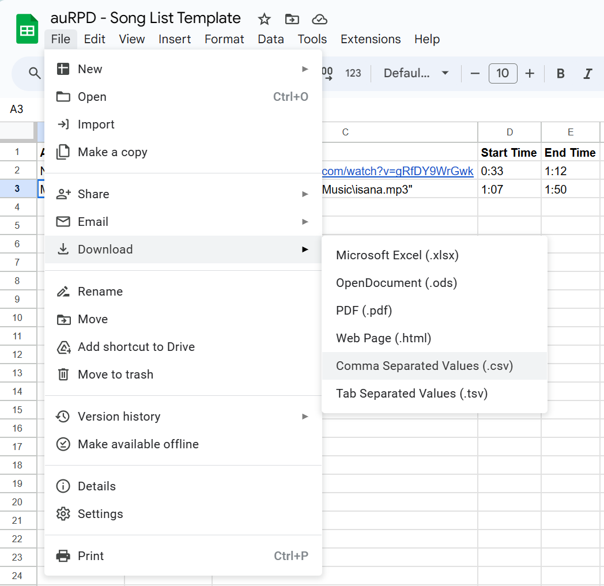

# auRPD
A tool to stitch together music for use at Random Play Dances

## Usage

### Installation

[Work In Progress]

### Collecting the songs
To begin collecting the songs, make a copy of [this Google Sheet](https://docs.google.com/spreadsheets/d/11ofrjMvB3h6gkTzuLHRcmCVX5rU6zSm3h9cUSw6fPqE/edit?usp=sharing). Each row represents a single song, for which you must provide the artist and title, the YouTube URL, and the start and end times (in seconds) of the portion of the song you want to use. **You must not leave any fields blank.**

	Please note that the timestamps do not account for fade in/out, so you should add a few seconds to the start and end times to account for this.

Once you have filled out the sheet, download it as a CSV file. On Google Sheets, this can be done by clicking `File > Download > Comma Separated Values (.csv)`.

### Running the program

[Work In Progress]